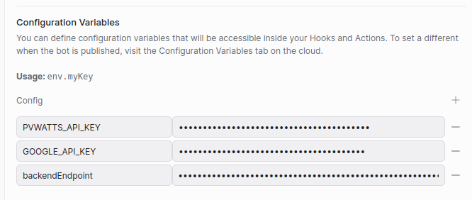

# WattsonBot

WattsonBot is a Botpress implementation designed to assist in the estimation and implementation of off-grid solar systems in Colombia. This bot is created to guide users through the process of evaluating their energy needs and providing an estimate of the appropriate solar system size and cost.

For a live demo of this Bot got to: https://mediafiles.botpress.cloud/a12b9dbb-13e2-492a-89b7-26a7358d0d79/webchat/bot.html

# Workflow
1. User initiates interaction with the bot.
2. Bot guides user through data collection process.
3. Bot sends an API request to AWS backend to generate the production report.
4. Backend creates a report, stores it in a private S3 bucket, and returns a signed URL for report download.
5. Bot provides the user with the PDF report.
6. With user's authorization, their information is stored for future contact.


# System Architecture

## BotpressBot
Handles user interactions, guiding them through the process of providing necessary information for solar system estimation. It collects data such as average monthly energy consumption, last month's consumption, and the cost of the last energy bill.

## AWS Serverless Backend / API
Processes the information provided by the user to calculate the most suitable solar system size. It also generates a detailed production report, including a cost analysis and estimated energy production.

## External APIs
WattsonBot integrates with several external APIs:

* **Google Maps Geocoding API**: Used to obtain the coordinates of the user's location based on their address.
* **PVWATTS API**: Provided by the National Renewable Energy Laboratory (NREL), this API is used to estimate the solar potential and energy production of the proposed solar system. It considers factors such as location, system size, and panel orientation to provide precise energy production estimates.
* **API2PDF**: Converts the production report, which includes detailed production and cost analysis, into a PDF format. 

## Important 
This application uses various AWS services and there are costs associated with these services after the Free Tier usage - please see the [AWS  pricing page](https://aws.amazon.com/pricing/) for details.


# Requirements

* **AWS CLI** already configured with Administrator permission
* **SAM CLI**. You can follow the [official guide](https://docs.aws.amazon.com/serverless-application-model/latest/developerguide/serverless-sam-cli-install.html) for installation instructions.
* [Google Maps Geocoding API Key](https://developers.google.com/maps/documentation/geocoding/get-api-key)
* [PVWatts API Key](https://developer.nrel.gov/docs/solar/pvwatts/v8/)
* [API2PDF API Key](https://portal.api2pdf.com/register)


# Installation Instructions

Clone this repository:

```bash

git clone https://github.com/amorenob/WattsonBot.git

```


## Deploying the Backend API
This process will establish the necessary resources for the backend API functions in AWS. Essentially, it sets up a serverless project with an AWS Lambda function, `GetProdReport`. This function is tasked with generating the estimated production report in PDF format. Additionally, it configures the API interface with Botpress, facilitating the communication between the bot and the backend.


1. [Create an AWS account](https://portal.aws.amazon.com/gp/aws/developer/registration/index.html) if you do not already have one and login.

2. **Setting Up the Serverless project**  
The backend interact with sveral external APIs in order to process the user data an generate the production report, so you will need to edit the [`template.yalm`](./template.yaml) to include the required info. Search for the `GetProdReportFunction` section and include your APIs keys for each service:  

      

3. **Build and deploy**  
Navigate to the root directory of the application and run the following commands:  
    ```bash
    sam build
    sam deploy --guided
    ```  
    The `sam build` command will build the source of your application. The `sam deploy --guided` command will package and deploy your application to AWS, guided by prompts for configuration parameters. This will create and deploy the serverless project with AWS Lambda functions. 

4. **API Endpoint**  
    After successfully deploying the application, AWS will provide an API Gateway endpoint. This endpoint is crucial for the functioning of the WattsonBot as it serves as the communication link between the bot and the backend.  
    
    The endpoint will look something like this: `https://<random-id>.execute-api.<region>.amazonaws.com/Prod/prod-report`  
    You'll need to save this endpoint URL as it will be required in the next steps, specifically when setting up the bot in Botpress. The bot will use this endpoint to send GET requests to generate the solar energy production reports.   

    

    Alternatively, you can find your API Gateway endpoint by navigating to the [API Gateway section](https://console.aws.amazon.com/apigateway/main/apis) of the AWS Management Console. After selecting your API, you'll find the Invoke URL at the top of the page.

    Please note that every time you deploy your application, the API Gateway endpoint remains the same unless you delete the stack and recreate it.

## Setting Up the Botpress Bot
Now that we have our backend API ready and the endpoint URL at hand, the next step is to set up the Botpress Bot.

1. **Create a Botpress account**  
If you do not already have one and login. [Creating a Botpress account](https://botpress.com/) 
2. **Import the WattsonBot template**  
The bot template is in the file "", follow the next guide to imported and create the bot in Botpress... [Importing a bot template](https://botpress.com/docs/cloud/studio/import-export/) 
3. **Setting Up the Bot**
Navigate to the bot settings and configure the environment variables `PVWATTS_API_KEY`,  `GOOGLE_API_KEY` and the  the endpoint URL that you obtained during the backend deployment.  

    


4. **Deploy and Test**
    After setting up the bot and configuring the environment variables and endpoint, it's time to deploy and test the bot.

    To deploy the bot, navigate to the Botpress admin panel and click on the 'Deploy' button. This will make your bot live and ready to interact with users.

    For testing, you can use the built-in chat emulator in Botpress. Simply type your messages in the chat emulator and verify that the bot responds correctly. You can also test the bot's ability to generate a solar energy production report by providing the necessary data.

    Remember to check the logs for any errors or issues. If the bot is not working as expected, the logs can provide valuable information for troubleshooting.  

.    
# Serverless BackEnd
  
## GetProdReport Function

The `GetProdReport` function is responsible for generating an estimated production report for solar energy projects.

The function is implemented as an AWS Lambda function, which is triggered via an HTTP GET request. The function takes in the following parameters:

- `latitude`: The latitude of the location for the solar energy system.
- `longitude`: The longitude of the location for the solar energy system.
- `system_capacity`: The capacity of the proposed solar energy system in kilowatts.
- `avg_daily_consumption`: The average daily electricity consumption in kilowatt-hours (kWh). 
- `panels_capacity`: The capacity of each solar panel in the system, measured in watts (W). This value is used to calculate the total number of panels needed for the system.
- `costPerKwh`: The cost per kilowatt-hour (kWh) of electricity. This value is used to calculate the potential savings from using solar energy.

The function processes this data to calculate the annual solar energy production, the number of solar panels required, and the necessary area for the solar panels. It also computes the financial aspects of the project, including the installation cost, the utility bill with and without solar, and the total cost with solar after incentives. 

Please note that the financial analysis is based on several variables, including the user's location, local installation costs, incentives, and regulations. Therefore, it's crucial to customize these parameters to accurately reflect your specific situation. You can modify these parameters in the [config.py](./getProdReport/config.py) file.


For more information on how these calculations are made, refer to this [Guide](https://developers.google.com/maps/documentation/solar/calculate-costs-non-us) from the Google Solar API.


To use the `GetProdReport` function, you need to send a GET request to the `/prod-report` endpoint with the required parameters. The function will then generate the report and return a signed URL to access the report in the S3 bucket.

## How to edit the Production Report

The production report is generated using a `.docx` template. If you need to modify the report's layout or content, simply edit this template. 

To include additional data in the report, add the corresponding placeholder in the template using double curly braces `{{}}`. Then, pass the new data by adding it to the `template_context` variable in the `getProdReport` function. This ensures that the new data is correctly inserted into the report. 

Please note, it's essential to build and deploy the project after making any changes. This step ensures that the updated version is uploaded to AWS and your changes are reflected in the live application.

==============================================
